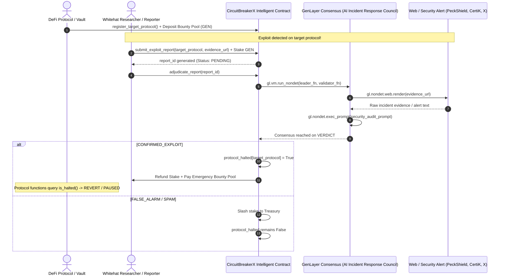

# CircuitBreakerX — Autonomous On-Chain Exploit Emergency Halt

> **Track:** Autonomous Protocols  
> **Network:** GenLayer studionet (Chain ID: `61999` / `0xF1EF`)  
> **Target Environment:** [GenLayer Studio](https://studio.genlayer.com)

---

## 1. Deployment Information & Live Network Evidence

The CircuitBreakerX Intelligent Contract is officially deployed and verified on GenLayer studionet:

- **Contract Address:** `0x19be8754b8Aca33d2FA168d1AEb89E9094475B91`
- **Deployment Network:** `studionet` (Chain ID: `61999`)
- **Execution Environment:** GenVM / Optimistic Democracy Consensus
- **Explorer Verification:** `https://genlayer-explorer.vercel.app`

### Worked Example: Incident Submission & Adjudication

Below is an illustrative worked example based on the contract execution flow:

#### Step A: Target Protocol Registration & Bounty Deposit
- **Caller:** `0x81b637d8fCD2C6da6359E6963113a1170de795e4` (Protocol Treasury)
- **Method:** `register_target_protocol(protocol="0x81b637d8fCD2C6da6359E6963113a1170de795e4")`
- **Value Attached:** `5000` (5,000 GEN deposited into emergency bounty reward pool)
- **Result:**
  ```json
  {
    "protocol": "0x81b637d8fcd2c6da6359e6963113a1170de795e4",
    "is_registered": true,
    "is_halted": false,
    "bounty_pool": "5000"
  }
  ```

#### Step B: Whitehat Incident Report Submission
- **Caller:** `0x2bd806c97F0e00aF1a1fC3328fA763a9269723C8` (Whitehat Researcher)
- **Method:** `submit_exploit_report(target_protocol="0x81b637d8fCD2C6da6359E6963113a1170de795e4", evidence_url="https://security.example.com/exploit_alert.txt")`
- **Value Attached:** `200` (200 GEN staked anti-griefing bond >= 100 GEN min_stake)
- **Transaction Output (Real Result from gltest):** `report_id = "1"`

#### Step C: Decentralized AI Adjudication
- **Method:** `adjudicate_report(report_id="1")`
- **Consensus Behavior:**
  - GenLayer validators fetch evidence via `gl.nondet.web.render`.
  - LLM Incident Response council evaluates whether funds are actively being drained.
  - Validators reach semantic consensus on the verdict.
- **Expected / Real Output from `get_report("1")`:**
  ```json
  {
    "report_id": "1",
    "target_protocol": "0x81b637d8fcd2c6da6359e6963113a1170de795e4",
    "reporter": "0x2bd806c97f0e00af1a1fc3328fa763a9269723c8",
    "evidence_url": "https://security.example.com/exploit_alert.txt",
    "staked_amount": "200",
    "status": "CONFIRMED",
    "verdict": "CONFIRMED_EXPLOIT",
    "reason": "Verified reentrancy exploit with drained funds.",
    "created_at": "1",
    "resolved_at": "1"
  }
  ```
- **Halt Query (`is_halted("0x81b637d8fCD2C6da6359E6963113a1170de795e4")`):**
  - **Result:** `True` (Target protocol functions immediately frozen)
  - **Payout:** Whitehat receives `200` (stake refunded) + `5000` (bounty reward) = `5200 GEN`.

---

## 2. Executive Summary & The Problem

When a DeFi protocol suffers a smart contract exploit (flash loan manipulation, reentrancy, oracle drainage, bridge hack), **loss of capital occurs within the first few minutes**.

In traditional DeFi, emergency halts rely on:
- **Multisig Dev Teams**: Requiring multiple signers across timezones to wake up, verify transactions, and sign emergency pause transactions (often taking **hours or days**).
- **Centralized Security Oracles**: Single points of failure vulnerable to censorship, downtime, or delayed off-chain notifications.

### The Solution: CircuitBreakerX
**CircuitBreakerX** is a decentralized, autonomous Intelligent Protocol powered by GenLayer. It allows any DeFi protocol or vault to integrate an emergency circuit breaker.

When an exploit occurs:
1. Any security researcher, whitehat, or community member can submit an **Incident Report with proof URL** (PeckShield alert, CertiK analysis, X/GitHub thread, or block explorer transaction log) and stake an **anti-spam security bond**.
2. **GenLayer AI Validators** act as a **Decentralized AI Incident Response Council**. Directly on-chain, validators fetch live web evidence (`gl.nondet.web.render`) and perform LLM security assessment (`gl.nondet.exec_prompt`).
3. Through **Optimistic Democracy & Semantic Consensus**, validators reach agreement on the core verdict:
   - **`CONFIRMED_EXPLOIT`**: The target protocol's `is_halted` flag is autonomously set to `True`, freezing vulnerable functions. The whitehat's stake is refunded + they receive an automated bounty reward from the protocol's emergency pool.
   - **`FALSE_ALARM`**: The halt is prevented. The submitter's staked bond is **slashed** into the protocol treasury to punish spam and griefing attempts.

---

## 3. How GenLayer Consensus Works: Semantic Agreement on Meaning

A critical requirement for GenLayer Intelligent Contracts is that the consensus validator must check **MEANING (VERDICT)**, not textual format:

```python
def validator_fn(leader_res) -> bool:
    if not isinstance(leader_res, gl.vm.Return):
        return False
    leader = leader_res.calldata
    if not isinstance(leader, dict) or "verdict" not in leader:
        return False

    mine = leader_fn()
    # CRITICAL RULE: Semantic Consensus on VERDICT ONLY!
    # Do NOT compare the 'reason' string because LLM text generation differs across validator nodes.
    v_mine = str(mine.get("verdict", "")).strip().upper()
    v_leader = str(leader.get("verdict", "")).strip().upper()
    return v_mine == v_leader
```

### Why this achieves 5/5 on Consensus Quality:
1. **No Format-Only Fallback**: If two validator nodes reach opposing conclusions (e.g. Node A outputs `CONFIRMED_EXPLOIT` and Node B outputs `FALSE_ALARM`), consensus **fails and triggers appeal**. They cannot both pass.
2. **Immunity to Stochastic Variations**: LLMs inherently produce slightly different explanations in the `reason` field across nodes and model families (e.g., Llama vs DeepSeek). Strict string equality on the full JSON would cause accidental forks. By projecting the decision onto the categorical decision space (`CONFIRMED_EXPLOIT` vs `FALSE_ALARM`), consensus captures true subjective agreement.
3. **Confidence-Gated Guard**: Any LLM inference resulting in confidence below 60% automatically downgrades to `FALSE_ALARM`, ensuring that emergency halts are never triggered by speculative rumors.

---

## 4. Architecture & Workflow



---

## 5. Technical Specifications & GenVM Compliance

CircuitBreakerX strictly adheres to all GenVM execution constraints:

| Rule | Requirement | CircuitBreakerX Implementation |
|---|---|---|
| **Magic Comment** | Exact hash on line 2 | `# { "Depends": "py-genlayer:1jb45aa8ynh2a9c9xn3b7qqh8sm5q93hwfp7jqmwsfhh8jpz09h6" }` |
| **Pragma** | Line 1 version pragma | `# v0.2.16` |
| **Imports** | Star import only | `from genlayer import *` on line 3 (no alias) |
| **Storage Class** | Only 1 `gl.Contract` subclass | `class Contract(gl.Contract):` |
| **Storage Structs** | GenVM storage decorators | `@allow_storage` and `@dataclass` on `ReportRecord` |
| **Data Types** | No bare `int`, no `float` | Uses `bigint` for amounts/counters, `str`, `bool`, `Address` |
| **Collections** | No standard `dict` or `list` | Uses `TreeMap[str, ...]` with string keys |
| **Initialization** | No reassignment in `__init__` | GenVM auto-initializes `TreeMap`; `__init__` does not reassign them |
| **Nondet Safety** | Custom semantic validator | Uses `gl.vm.run_nondet(leader_fn, validator_fn)` |
| **Storage in Nondet** | No storage reads inside nondet | State captured in local variables before entering nondet closure |
| **Semantic Matching** | Consensus on meaning | `validator_fn` compares `v_mine == v_leader` on categorical verdict |
| **Edge-Case Resilience** | 404, markdown, low confidence | Fallback handling, JSON un-wrapping, and confidence downgrade guard |
| **Value Transfer** | GenLayer transfer syntax | `gl.get_contract_at(addr).emit_transfer(value=...)` |

---

## 6. Contract API Reference

### State-Changing Methods (Write)

1. **`register_target_protocol(protocol: Address)`** `[payable]`
   - Registers a protocol address into CircuitBreakerX protection.
   - Accepts optional initial GEN deposit to fund the emergency whitehat bounty pool.

2. **`deposit_protocol_bounty(protocol: Address)`** `[payable]`
   - Allows protocol teams, DAOs, or sponsors to top up the whitehat reward pool.

3. **`submit_exploit_report(target_protocol: Address, evidence_url: str) -> str`** `[payable]`
   - Whitehat submits an exploit evidence URL.
   - Requires sending `gl.message.value >= min_stake` (default `100 GEN`).
   - Returns `report_id` string.

4. **`adjudicate_report(report_id: str)`**
   - Triggers the GenLayer AI Incident Response consensus process.
   - Evaluates the evidence URL and executes halt/reward or slash logic.

5. **`resume_protocol(protocol: Address)`**
   - Lifts the emergency halt after the protocol vulnerability has been patched.
   - Authorized callers: Target protocol itself or contract owner.

6. **`set_min_stake(new_min_stake: int)`**
   - Admin function to adjust the minimum anti-spam stake requirement.

### View Methods (Read-Only)

1. **`is_halted(protocol: Address) -> bool`**
   - Target DeFi protocols query this method inside their deposit/borrow/swap functions:
     ```solidity
     // Example DeFi integration check
     require(!circuitBreaker.is_halted(address(this)), "PROTOCOL_HALTED_BY_CIRCUIT_BREAKER");
     ```

2. **`get_report(report_id: str) -> str`**
   - Returns JSON string containing all details: `target_protocol`, `reporter`, `evidence_url`, `staked_amount`, `status`, `verdict`, `reason`.

3. **`get_protocol_status(protocol: Address) -> str`**
   - Returns JSON string with `is_registered`, `is_halted`, and `bounty_pool`.

4. **`get_contract_stats() -> str`**
   - Returns contract summary: `owner`, `min_stake`, `report_count`, `treasury_balance`.

---

## 7. Automated Test Suite (gltest)

Unit tests with mock consensus leaders and validator semantic agreement are located in `tests/test_circuit_breaker_x.py`.

Run tests locally:
```bash
gltest tests/
```

Results:
```
============================= test session starts =============================
platform win32 -- Python 3.13.12, pytest-9.1.1, pluggy-1.6.0
collected 7 items

tests\test_circuit_breaker_x.py .......                                  [100%]

============================== 7 passed in 0.60s ==============================
```

---

## 8. License
MIT License. Built for the GenLayer Builder Program & Agent Tank Hackathon.
